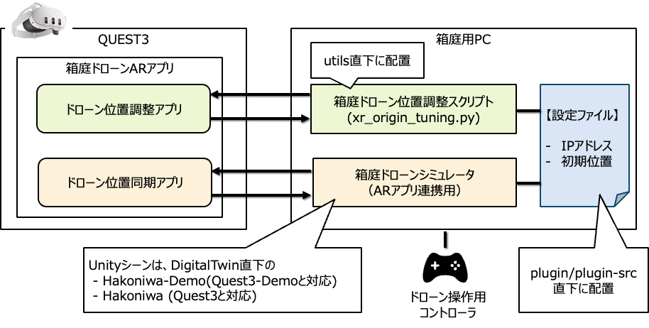

# はじめに

本ドキュメントでは、箱庭ドローンシミュレータをARアプリと連携するための方法を説明します。

なお、QUEST3アプリの作成手順については、[こちら](./README-quest3.md)を参照ください。

# アーキテクチャ

全体アーキテクチャ下図の通りです。



QUEST3には、箱庭ドローンシミュレータの位置情報を同期して表示するアプリがあります。

このアプリは、起動直後はAR座標の原点を調整するモード(ドローン位置調整アプリ)に入り待機します。

このタイミングで、箱庭用PCから、箱庭ドローン位置調整スクリプト(xr_origin_tuning.py)を実行し、PS4コントローラで原点調整をします。

位置調整完了後、⚪︎ボタンを押下すると、QUEST3アプリは、ドローン位置同期アプリに処理を遷移させ、箱庭ドローンシミュレータ（ARアプリ連携用）と通信しながら、AR空間にドローンを表示させます。


# 設定ファイル

QUEST3と箱庭用PCは互いにUDP通信するため、設定ファイルにて、IPアドレスを指定しておく必要があります。

設定ファイルは、`hakoniwa-unity-drone-model/plugin/plugin-srcs` 直下に、`xr_config.json`として配置します。

書式は以下の通り。

```json
{
    "server_url": "192.168.12.11:54002",
    "client_url": "192.168.12.2:54001",
    "position": [
        0.5,
        0.5,
        0
    ],
    "rotation": [
        0,
        -109.0,
        0
    ]
}
```

- server_url: QUEST3のURLです。
- client_url: 箱庭用PCのURLです。
- position: 初期位置です。`(x, y, z)` の並び順で、Unity座標系です。単位は`m(メートル)`です。
- rotation: 初期角度です。`(x, y, z)` の並び順で、Unity座標系です。単位は`degree(度)`です。

# 箱庭ドローン位置調整スクリプト

箱庭ドローン位置調整スクリプトの実行方法は以下の通りです。

```bash
python utils/xr_origin_tuning.py --input joystick ./plugin/plugin-srcs/xr_config.json <QUEST3のIPアドレス>:38528
```

`hakoniwa-unity-drone-model`直下で実行してください。

# 箱庭ドローンシミュレータ（ARアプリ連携用）

箱庭ドローンシミュレータ（ARアプリ連携用）の構成は、`hakoniwa-px4sim/hakoniwa/drone-app.bash`と`Unity`で構成されています。

`hakoniwa-px4sim/hakoniwa/drone-app.bash`については、そのまま同じ方法で利用できます。

`Unity`については、以下のUnityシーンを利用ください。

 - Hakoniwa-Demo(Quest3-Demoと対応)
 - Hakoniwa (Quest3と対応)

`()`内のものは、QUEST3向けのアプリケーションとの対応関係を示しています。


# 操作手順

以下の資料を参照ください。

https://www.docswell.com/s/kanetugu2015/K4VVJD-hakoniwa-drone-ar-op
